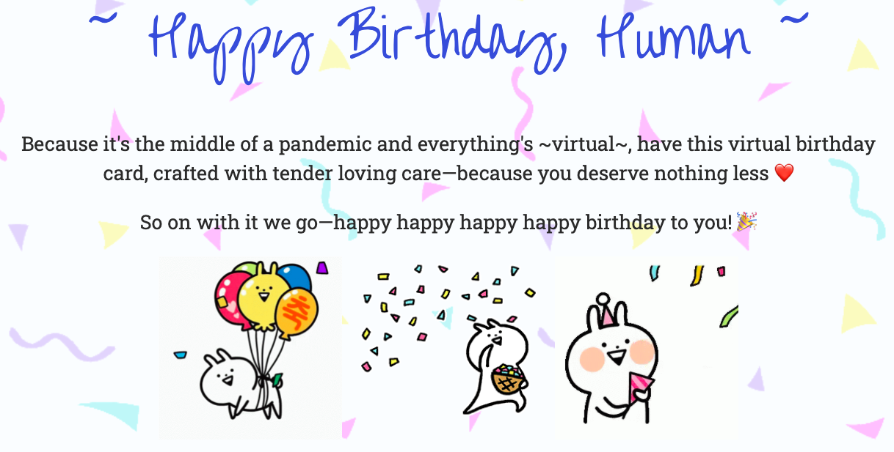

# Virtual Birthday Card

I created this card for my sister's birthday when I wasn't able to wish her in person. It's a static site designed with Svelte and lots of CSS. Here's what it looks like:



Most of the card's content is in [src/App.svelte](https://github.com/insiyab/happy-birthday/blob/master/src/App.svelte).

### Develop and Deploy

To build and run this code, clone this repo, `cd` into it, and run the following commands:

```bash
npm install
npm run dev
```

Then head over to [localhost:5000](http://localhost:5000/).

To publish using [surge](https://surge.sh/):
```bash
npm install
npm run build
surge public happy-birthday.surge.sh
```

To teardown the published surge site:
```bash
surge teardown happy-birthday.surge.sh
```

To publish using [Vercel](https://vercel.com):
```bash
npm install
cd public
vercel deploy --name my-project
```
